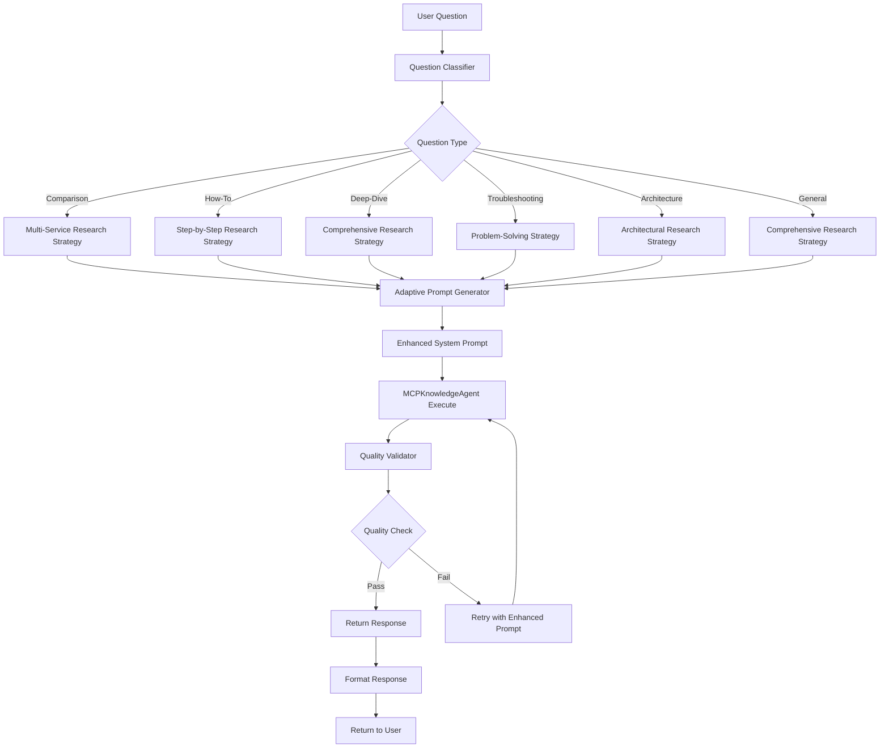

# Implementation Plan: Enhanced Analyze Mode with Adaptive Research Assistant

## Overview

Transform the analyze mode from a one-size-fits-all approach to an adaptive research assistant that:

- Classifies questions into types (comparison, how-to, deep-dive, troubleshooting, architecture, pricing, integration)
- Uses question-type-specific research strategies
- Validates output quality with citations and completeness checks
- Produces tailored, well-researched answers with multiple documentation sources

## Architecture Flow



## Components to Implement

### 1. Question Classification System

**File:** `backend/services/question_classifier.py` (new)

- Classify questions into 7 types based on keywords and patterns
- Return question type, confidence score, and research strategy
- Handle multi-type questions (e.g., "compare and explain")

### 2. Adaptive Prompt Generator

**File:** `backend/services/adaptive_prompt_generator.py` (new)

- Generate question-type-specific prompts
- Include research workflow instructions
- Add quality requirements
- Incorporate conversation context

### 3. Quality Validator

**File:** `backend/services/quality_validator.py` (new)

- Validate citations (count, URL validity)
- Check tool usage (documentation tools called)
- Verify completeness (all expected aspects covered)
- Score response quality
- Generate quality reports

### 4. Enhanced Analyze Endpoint

**File:** `backend/main.py` (modify)

- Integrate classification, prompt generation, and quality validation
- Add quality-based retry logic
- Track quality metrics

### 5. Enhanced MCPKnowledgeAgent

**File:** `backend/services/strands_agents_simple.py` (modify)

- Add quality-enhanced system prompt method
- Track tool usage for validation
- Return structured response with quality metadata

## Implementation Steps

### Step 1: Create Question Classifier

**File:** `backend/services/question_classifier.py`

```python
QUESTION_TYPES = {
    "comparison": {
        "keywords": ["vs", "compare", "difference", "better", "which", "versus"],
        "research_strategy": "multi_service_comparison",
        "output_format": "comparative_analysis",
        "min_sources": 4
    },
    "how_to": {
        "keywords": ["how", "implement", "setup", "configure", "create", "build"],
        "research_strategy": "step_by_step_guide",
        "output_format": "tutorial_format",
        "min_sources": 5
    },
    "deep_dive": {
        "keywords": ["explain", "understand", "details", "how does", "what is", "why"],
        "research_strategy": "comprehensive_research",
        "output_format": "detailed_explanation",
        "min_sources": 6
    },
    "troubleshooting": {
        "keywords": ["error", "issue", "problem", "fix", "debug", "why", "not working"],
        "research_strategy": "problem_solving",
        "output_format": "solution_oriented",
        "min_sources": 4
    },
    "architecture": {
        "keywords": ["architecture", "design", "pattern", "best practice", "recommend"],
        "research_strategy": "architectural_research",
        "output_format": "architectural_guidance",
        "min_sources": 5
    },
    "pricing": {
        "keywords": ["cost", "price", "pricing", "expensive", "cheap", "budget"],
        "research_strategy": "pricing_research",
        "output_format": "cost_analysis",
        "min_sources": 3
    },
    "integration": {
        "keywords": ["integrate", "connect", "work with", "together", "combine"],
        "research_strategy": "integration_research",
        "output_format": "integration_guide",
        "min_sources": 4
    }
}

def classify_question(question: str) -> Dict[str, Any]:
    """Classify question type and return research strategy"""
    # Implementation with keyword matching and confidence scoring

def is_follow_up_question(question: str, conversation_history: List[str] = None) -> bool:
    """Detect if question is a follow-up based on conversation context"""
    # Check for follow-up indicators
    # Check if references previous topics
    # Return True if likely follow-up
```

### Step 2: Create Adaptive Prompt Generator

**File:** `backend/services/adaptive_prompt_generator.py`

```python
RESEARCH_STRATEGIES = {
    "multi_service_comparison": """
    PHASE 1 - SERVICE IDENTIFICATION:
    1. Identify services being compared
    2. Search documentation for each service
    
    PHASE 2 - COMPARATIVE RESEARCH:
    3. Read feature comparison guides
    4. Find use case documentation
    5. Research pricing and performance
    
    PHASE 3 - COMPARISON SYNTHESIS:
    6. Create comparison matrix
    7. Identify trade-offs
    8. Provide recommendations
    """,
    # ... more strategies
}

def create_adaptive_prompt(
    question: str,
    question_type: Dict,
    previous_context: Dict = None
) -> str:
    """
    Generate adaptive prompt based on question type.
    If previous_context provided, create context-aware follow-up prompt.
    """
    base_prompt = create_base_prompt(question, question_type)
    
    if previous_context:
        # Add context-aware section for follow-ups
        context_section = f"""
PREVIOUS ANALYSIS CONTEXT:
Previous Question: {previous_context.get('question', 'N/A')}
Summary: {previous_context.get('summary', '')[:500]}
Services Discussed: {', '.join(previous_context.get('services', []))}
Topics Covered: {', '.join(previous_context.get('topics', []))}

CURRENT FOLLOW-UP QUESTION: {question}

INSTRUCTIONS FOR FOLLOW-UP:
- Build upon the previous analysis
- Reference previously discussed services when relevant
- Provide deeper insights into topics already covered
- Connect new information to previous discussion
- Maintain conversation continuity
- Cite documentation sources that expand on previous discussion
"""
        return f"{base_prompt}\n\n{context_section}"
    
    return base_prompt
```

### Step 4: Create Quality Validator

**File:** `backend/services/quality_validator.py`

```python
def validate_response_quality(
    response: str,
    question: str,
    question_type: Dict,
    tool_usage_log: List[Dict]
) -> Dict[str, Any]:
    """Validate response meets quality standards"""
    # Check citations, tool usage, completeness, format
    # Return quality score and validation results
```

### Step 4: Enhance Analyze Endpoint

**File:** `backend/main.py`

Modify `analyze_requirements()` function:

- Add question classification
- Use adaptive prompt generator
- Add quality validation
- Implement quality-based retry logic
- Return quality metadata

### Step 6: Enhance MCPKnowledgeAgent

**File:** `backend/services/strands_agents_simple.py`

- Add `_get_quality_enhanced_system_prompt()` method
- Track tool usage in execute method
- Return tool usage metadata for validation
- Extract and return analysis summary for context storage

## Expected Results Examples

### Example 1: Comparison Question

**Input:** "What's the difference between Lambda and ECS? When should I use each?"

**Expected Output Structure:**

```
## Comparison: AWS Lambda vs Amazon ECS

### Overview
[Brief comparison summary with citations]

### Feature Comparison Table
| Feature | Lambda | ECS |
|---------|--------|-----|
| Compute Model | Serverless | Containers |
| ... | ... | ... |

### When to Use Lambda
- [Use case 1 with example]
- [Use case 2 with example]

### When to Use ECS
- [Use case 1 with example]
- [Use case 2 with example]

### Trade-offs Analysis
[Detailed trade-off breakdown]

### Documentation Sources
- [AWS Lambda Developer Guide](https://docs.aws.amazon.com/lambda/)
- [Amazon ECS Developer Guide](https://docs.aws.amazon.com/ecs/)
- [Choosing Compute Service](https://docs.aws.amazon.com/...)
- [Lambda vs Containers](https://docs.aws.amazon.com/...)

### Follow-up Questions
- How do I migrate from Lambda to ECS?
- What are the cost implications?
```

**Quality Metrics:**

- Citations: 4+ sources
- Tool usage: 5+ documentation searches
- Completeness: All comparison aspects covered
- Format: Comparison table present

### Example 2: How-To Question

**Input:** "How do I set up a Lambda function to process S3 uploads?"

**Expected Output Structure:**

```
## How to Set Up Lambda Function to Process S3 Uploads

### Prerequisites
- [List with explanations]

### Step-by-Step Guide

**Step 1: Create S3 Bucket**
[Detailed instructions with code examples]

**Step 2: Create Lambda Function**
[Instructions with code]

**Step 3: Configure IAM Permissions**
[IAM policy examples]

**Step 4: Configure S3 Event Notification**
[Configuration steps]

### Troubleshooting
[Common issues and solutions]

### Best Practices
[From AWS documentation]

### Documentation Sources
- [Lambda with S3 Tutorial](https://docs.aws.amazon.com/lambda/...)
- [S3 Event Notifications](https://docs.aws.amazon.com/...)
- [Lambda IAM Permissions](https://docs.aws.amazon.com/...)
```

**Quality Metrics:**

- Citations: 3+ sources
- Code examples: Present
- Step completeness: All steps covered
- Troubleshooting: Included

### Example 3: Deep Dive Question

**Input:** "Explain how AWS Lambda works under the hood. How does it handle scaling?"

**Expected Output Structure:**

```
## AWS Lambda: How It Works Under the Hood

### What is AWS Lambda?
[Core explanation with citations]

### Core Architecture
[Technical details with diagrams references]

### How Scaling Works
[Detailed explanation with examples]

### Concurrency Model
[Technical deep dive]

### Cold Starts Explained
[Comprehensive explanation]

### Documentation Sources
- [Lambda Developer Guide](https://docs.aws.amazon.com/lambda/)
- [Lambda Scaling Documentation](https://docs.aws.amazon.com/...)
- [Lambda Architecture](https://docs.aws.amazon.com/...)
- [Well-Architected Serverless Lens](https://docs.aws.amazon.com/...)
```

**Quality Metrics:**

- Citations: 6+ sources
- Technical depth: Comprehensive
- Examples: Multiple examples included
- Cross-references: Related topics covered

## Quality Validation Criteria

### Minimum Quality Thresholds

1. **Citations:** Minimum 3-5 sources depending on question type
2. **Tool Usage:** Minimum 3-5 documentation tool calls
3. **Completeness:** 80%+ coverage of expected aspects
4. **Format Compliance:** Follows question-type-specific format
5. **Actionability:** Contains actionable guidance
6. **Accuracy:** Facts verified against documentation

### Quality Score Calculation

```python
quality_score = (
    citation_score * 0.25 +
     completeness_score * 0.25 +
    tool_usage_score * 0.20 +
    format_score * 0.15 +
    actionability_score * 0.15
)

# Minimum passing score: 0.8 (80%)
```

## Files to Create/Modify

### New Files

1. `backend/services/question_classifier.py` - Question classification logic
2. `backend/services/adaptive_prompt_generator.py` - Adaptive prompt generation
3. `backend/services/quality_validator.py` - Quality validation and scoring
4. `backend/services/quality_metrics.py` - Quality metrics tracking (optional)

### Modified Files

1. `backend/main.py` - Enhance `analyze_requirements()` function
2. `backend/services/strands_agents_simple.py` - Enhance `MCPKnowledgeAgent` class

## Testing Strategy

1. **Unit Tests:** Test classification, prompt generation, quality validation
2. **Integration Tests:** Test full flow with mock agent responses
3. **Quality Tests:** Verify quality scores meet thresholds
4. **Example Tests:** Test with example questions from each type

## Success Criteria

1. Questions correctly classified (90%+ accuracy)
2. Follow-up questions detected (both clicked and typed) - 85%+ accuracy
3. Context extracted and used for follow-ups - 100% when context available
4. Quality scores meet thresholds (80%+ pass rate)
5. Citations present in all responses (100%)
6. Tool usage verified (3+ tools per response)
7. Output formats match question types (100%)
8. Follow-up answers reference previous context appropriately
9. User satisfaction improved (measured via feedback)

## Follow-Up Question Handling (Both Clicked and Typed)

### Detection Logic

**Backend (`backend/main.py`):**

- Check if `session_id` provided and has previous analysis
- Use `is_follow_up_question()` to detect typed follow-ups
- Extract previous context from session
- Pass `is_follow_up=True` flag to prompt generator

**Frontend (`frontend/src/App.tsx`):**

- For typed questions: Check conversation history before sending
- Pass `session_id` in API request
- Store `last_analysis` in conversation context

### Context Extraction

When a follow-up is detected:

1. Extract previous question and answer summary
2. Extract AWS services mentioned
3. Extract topics covered
4. Create context-aware prompt that references previous discussion
5. Use same adaptive research strategy but with context awareness

### Example Flow

**User:** "What's the difference between Lambda and ECS?"

**System:** [Provides comparison answer with citations]

**User types:** "How do I migrate from Lambda to ECS?"

**System detects:** Follow-up question (references Lambda and ECS from previous)

**System:**

- Extracts previous context (Lambda vs ECS comparison)
- Creates context-aware prompt: "Building on our previous discussion about Lambda vs ECS..."
- Uses adaptive research strategy for "how_to" question type
- References previous analysis in answer

## Rollout Plan

1. **Phase 1:** Implement classification and prompt generation
2. **Phase 2:** Add quality validation
3. **Phase 3:** Add retry logic and metrics tracking
4. **Phase 4:** Monitor and optimize based on metrics