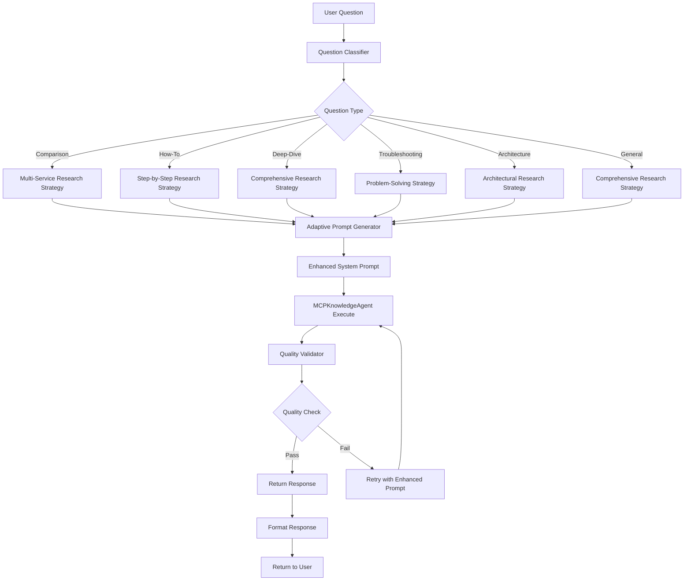
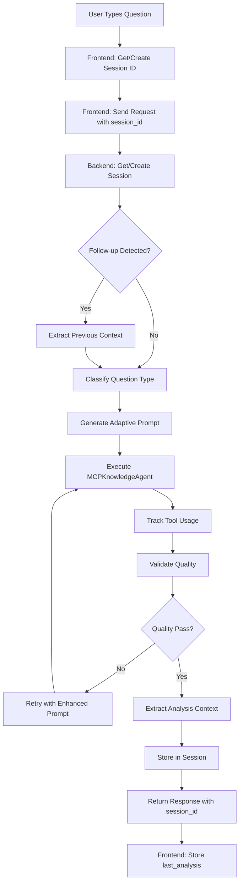

# Implementation Plan: Enhanced Analyze Mode with Adaptive Research Assistant

## Overview

Transform the analyze mode from a one-size-fits-all approach to an adaptive research assistant that:

- Classifies questions into types (comparison, how-to, deep-dive, troubleshooting, architecture, pricing, integration)
- Uses question-type-specific research strategies
- Validates output quality with citations and completeness checks
- Produces tailored, well-researched answers with multiple documentation sources

## Architecture Flow



## Components to Implement

### 1. Follow-Up Question Detector

**File:** `backend/services/follow_up_detector.py` (new)

- Detect if typed questions are follow-ups to previous analysis
- Use pattern matching and conversation history
- Extract previous analysis context from session
- Return detection confidence and reasoning
- Handle both clicked and typed follow-up questions

### 2. Context Extractor

**File:** `backend/services/context_extractor.py` (new)

- Extract AWS services mentioned in responses
- Extract topics covered in analysis
- Generate summary from responses
- Parse structured data from agent responses
- Support context storage and retrieval

### 3. Question Classification System

**File:** `backend/services/question_classifier.py` (new)

- Classify questions into 7 types based on keywords and patterns
- Return question type, confidence score, and research strategy
- Handle multi-type questions (e.g., "compare and explain")

### 4. Adaptive Prompt Generator

**File:** `backend/services/adaptive_prompt_generator.py` (new)

- Generate question-type-specific prompts
- Include research workflow instructions
- Add quality requirements
- Incorporate conversation context (for follow-ups)
- Create context-aware prompts for follow-up questions

### 5. Quality Validator

**File:** `backend/services/quality_validator.py` (new)

- Validate citations (count, URL validity)
- Check tool usage (documentation tools called)
- Verify completeness (all expected aspects covered)
- Score response quality
- Generate quality reports

### 6. Enhanced Session Manager

**File:** `backend/services/session_manager.py` (modify)

- Add `set_last_analysis()` method to store analysis context
- Add `get_last_analysis()` method to retrieve analysis context
- Define structure for `last_analysis` data
- Support analysis context storage and retrieval

### 7. Enhanced Analyze Endpoint

**File:** `backend/main.py` (modify)

- Add `session_id` parameter to `analyze_requirements()` function
- Integrate follow-up detection for typed questions
- Extract and use previous context for follow-ups
- Integrate classification, prompt generation, and quality validation
- Store analysis context after responses
- Add quality-based retry logic
- Track quality metrics

### 8. Enhanced MCPKnowledgeAgent

**File:** `backend/services/strands_agents_simple.py` (modify)

- Add quality-enhanced system prompt method
- Track tool usage in execute method
- Return tool usage metadata for validation
- Extract and return analysis summary for context storage

### 9. Frontend Session Management

**File:** `frontend/src/App.tsx` (modify)

- Get or create session_id on app initialization
- Store session_id in conversationState.context
- Pass session_id in analyze API requests
- Store last_analysis in conversation context after responses

## Implementation Steps

### Step 1: Create Question Classifier

**File:** `backend/services/question_classifier.py`

```python
QUESTION_TYPES = {
    "comparison": {
        "keywords": ["vs", "compare", "difference", "better", "which", "versus"],
        "research_strategy": "multi_service_comparison",
        "output_format": "comparative_analysis",
        "min_sources": 4
    },
    "how_to": {
        "keywords": ["how", "implement", "setup", "configure", "create", "build"],
        "research_strategy": "step_by_step_guide",
        "output_format": "tutorial_format",
        "min_sources": 5
    },
    "deep_dive": {
        "keywords": ["explain", "understand", "details", "how does", "what is", "why"],
        "research_strategy": "comprehensive_research",
        "output_format": "detailed_explanation",
        "min_sources": 6
    },
    "troubleshooting": {
        "keywords": ["error", "issue", "problem", "fix", "debug", "why", "not working"],
        "research_strategy": "problem_solving",
        "output_format": "solution_oriented",
        "min_sources": 4
    },
    "architecture": {
        "keywords": ["architecture", "design", "pattern", "best practice", "recommend"],
        "research_strategy": "architectural_research",
        "output_format": "architectural_guidance",
        "min_sources": 5
    },
    "pricing": {
        "keywords": ["cost", "price", "pricing", "expensive", "cheap", "budget"],
        "research_strategy": "pricing_research",
        "output_format": "cost_analysis",
        "min_sources": 3
    },
    "integration": {
        "keywords": ["integrate", "connect", "work with", "together", "combine"],
        "research_strategy": "integration_research",
        "output_format": "integration_guide",
        "min_sources": 4
    }
}

def classify_question(question: str) -> Dict[str, Any]:
    """Classify question type and return research strategy"""
    # Implementation with keyword matching and confidence scoring

def is_follow_up_question(question: str, conversation_history: List[str] = None) -> bool:
    """Detect if question is a follow-up based on conversation context"""
    # Check for follow-up indicators
    # Check if references previous topics
    # Return True if likely follow-up
```

### Step 2: Create Adaptive Prompt Generator

**File:** `backend/services/adaptive_prompt_generator.py`

```python
RESEARCH_STRATEGIES = {
    "multi_service_comparison": """
    PHASE 1 - SERVICE IDENTIFICATION:
 1. Identify services being compared
 2. Search documentation for each service
    
    PHASE 2 - COMPARATIVE RESEARCH:
 3. Read feature comparison guides
 4. Find use case documentation
 5. Research pricing and performance
    
    PHASE 3 - COMPARISON SYNTHESIS:
 6. Create comparison matrix
 7. Identify trade-offs
 8. Provide recommendations
    """,
    # ... more strategies
}

def create_adaptive_prompt(
    question: str,
    question_type: Dict,
    previous_context: Dict = None
) -> str:
    """
    Generate adaptive prompt based on question type.
    If previous_context provided, create context-aware follow-up prompt.
    """
    base_prompt = create_base_prompt(question, question_type)
    
    if previous_context:
        # Add context-aware section for follow-ups
        context_section = f"""
PREVIOUS ANALYSIS CONTEXT:
Previous Question: {previous_context.get('question', 'N/A')}
Summary: {previous_context.get('summary', '')[:500]}
Services Discussed: {', '.join(previous_context.get('services', []))}
Topics Covered: {', '.join(previous_context.get('topics', []))}

CURRENT FOLLOW-UP QUESTION: {question}

INSTRUCTIONS FOR FOLLOW-UP:
- Build upon the previous analysis
- Reference previously discussed services when relevant
- Provide deeper insights into topics already covered
- Connect new information to previous discussion
- Maintain conversation continuity
- Cite documentation sources that expand on previous discussion
"""
        return f"{base_prompt}\n\n{context_section}"
    
    return base_prompt
```

### Step 3: Create Follow-Up Detector

**File:** `backend/services/follow_up_detector.py`

```python
import re
from typing import Dict, Any, Optional, List
from services.session_manager import session_manager

FOLLOW_UP_PATTERNS = [
    r'how\s+(do|does|can|should)',
    r'what\s+(about|if|is|are)',
    r'tell\s+me\s+more',
    r'explain\s+(more|further)',
    r'can\s+you',
    r'what\s+about',
    r'how\s+about',
    r'what\s+else',
    r'also',
    r'additionally',
    r'furthermore'
]

def detect_follow_up_question(
    question: str,
    session_id: Optional[str] = None
) -> Dict[str, Any]:
    """
    Detect if a typed question is a follow-up to previous analysis
    
    Args:
        question: The user's question
        session_id: Optional session ID to check for previous context
    
    Returns:
        {
            "is_follow_up": bool,
            "confidence": float (0.0-1.0),
            "previous_context": Dict or None,
            "reasoning": str
        }
    """
    if not session_id:
        return {
            "is_follow_up": False,
            "confidence": 0.0,
            "previous_context": None,
            "reasoning": "No session_id provided"
        }
    
    session = session_manager.get_session(session_id)
    if not session:
        return {
            "is_follow_up": False,
            "confidence": 0.0,
            "previous_context": None,
            "reasoning": "Session not found"
        }
    
    last_analysis = session.get("last_analysis")
    if not last_analysis:
        return {
            "is_follow_up": False,
            "confidence": 0.0,
            "previous_context": None,
            "reasoning": "No previous analysis found"
        }
    
    question_lower = question.lower()
    confidence = 0.0
    reasoning_parts = []
    
    # Check for follow-up patterns
    has_pattern = False
    for pattern in FOLLOW_UP_PATTERNS:
        if re.search(pattern, question_lower):
            has_pattern = True
            confidence += 0.3
            reasoning_parts.append(f"Contains follow-up pattern: {pattern}")
            break
    
    # Check if references previous services
    previous_services = last_analysis.get("services", [])
    if previous_services:
        service_matches = sum(1 for service in previous_services 
                            if service.lower() in question_lower)
        if service_matches > 0:
            confidence += min(0.4, service_matches * 0.2)
            reasoning_parts.append(f"References {service_matches} previously discussed service(s)")
    
    # Check if references previous topics
    previous_topics = last_analysis.get("topics", [])
    if previous_topics:
        topic_matches = sum(1 for topic in previous_topics 
                          if topic.lower() in question_lower)
        if topic_matches > 0:
            confidence += min(0.3, topic_matches * 0.15)
            reasoning_parts.append(f"References {topic_matches} previously discussed topic(s)")
    
    # Check conversation history length (more history = more likely follow-up)
    history_length = len(session.get("conversation_history", []))
    if history_length > 0:
        confidence += min(0.1, history_length * 0.05)
        reasoning_parts.append(f"Conversation history exists ({history_length} exchanges)")
    
    is_follow_up = confidence >= 0.4  # Threshold for follow-up detection
    
    return {
        "is_follow_up": is_follow_up,
        "confidence": min(1.0, confidence),
        "previous_context": last_analysis if is_follow_up else None,
        "reasoning": "; ".join(reasoning_parts) if reasoning_parts else "No follow-up indicators found"
    }
```

### Step 4: Create Context Extractor

**File:** `backend/services/context_extractor.py`

```python
import re
from typing import Dict, List, Any

AWS_SERVICE_PATTERNS = [
    r'\b(?:AWS|Amazon)\s+([A-Z][a-zA-Z]+)\b',
    r'\b(Lambda|ECS|EC2|S3|RDS|DynamoDB|API Gateway|CloudFront|VPC|IAM|CloudFormation|Step Functions|EventBridge|SQS|SNS|Kinesis|Glue|Athena|Redshift|ElastiCache|Elasticsearch|OpenSearch|Route53|CloudWatch|X-Ray|CodePipeline|CodeBuild|CodeDeploy|ECS|EKS|Fargate|Batch|Elastic Beanstalk|Lightsail|AppSync|Amplify|Cognito|Secrets Manager|Parameter Store|Systems Manager|Config|CloudTrail|GuardDuty|WAF|Shield|KMS|Certificate Manager|Direct Connect|VPN|Transit Gateway|NAT Gateway|Elastic IP|Load Balancer|Auto Scaling|CloudFormation|Terraform|CDK)\b'
]

def extract_aws_services(text: str) -> List[str]:
    """Extract AWS service names from text"""
    services = set()
    for pattern in AWS_SERVICE_PATTERNS:
        matches = re.findall(pattern, text, re.IGNORECASE)
        for match in matches:
            if isinstance(match, tuple):
                services.add(match[0])
            else:
                services.add(match)
    return sorted(list(services))

def extract_topics(text: str) -> List[str]:
    """Extract key topics from analysis text"""
    # Look for section headers (markdown headers)
    topic_patterns = [
        r'^#{1,3}\s+(.+)$',  # Markdown headers
        r'###\s+(.+?)(?:\n|$)',  # H3 headers
        r'##\s+(.+?)(?:\n|$)',  # H2 headers
    ]
    
    topics = []
    for pattern in topic_patterns:
        matches = re.findall(pattern, text, re.MULTILINE)
        for match in matches:
            topic = match.strip()
            # Filter out common non-topics
            if topic.lower() not in ['overview', 'summary', 'documentation sources', 
                                     'follow-up questions', 'references', 'sources']:
                topics.append(topic)
    
    return topics[:10]  # Limit to top 10 topics

def generate_summary(text: str, max_length: int = 500) -> str:
    """Generate a summary of the analysis"""
    # Remove markdown formatting
    clean_text = re.sub(r'#{1,6}\s+', '', text)
    clean_text = re.sub(r'\*\*([^*]+)\*\*', r'\1', clean_text)
    clean_text = re.sub(r'\*([^*]+)\*', r'\1', clean_text)
    
    # Take first paragraph or first max_length characters
    paragraphs = clean_text.split('\n\n')
    summary = paragraphs[0] if paragraphs else clean_text[:max_length]
    
    if len(summary) > max_length:
        summary = summary[:max_length].rsplit(' ', 1)[0] + '...'
    
    return summary

def extract_analysis_context(response: str, question: str) -> Dict[str, Any]:
    """
    Extract structured context from analysis response
    
    Returns:
        {
            "question": str,
            "summary": str,
            "services": List[str],
            "topics": List[str],
            "timestamp": str
        }
    """
    from datetime import datetime
    
    return {
        "question": question,
        "summary": generate_summary(response),
        "services": extract_aws_services(response),
        "topics": extract_topics(response),
        "timestamp": datetime.now().isoformat()
    }
```

### Step 5: Enhance Session Manager

**File:** `backend/services/session_manager.py` (modify)

Add these methods to `SessionManager` class:

```python
def set_last_analysis(
    self,
    session_id: str,
    question: str,
    answer: str,
    services: List[str] = None,
    topics: List[str] = None,
    summary: str = None
) -> bool:
    """
    Store analysis context for follow-up detection
    
    Args:
        session_id: Session identifier
        question: The question asked
        answer: The analysis response
        services: List of AWS services mentioned (optional, will be extracted)
        topics: List of topics covered (optional, will be extracted)
        summary: Summary of analysis (optional, will be generated)
    
    Returns:
        True if successful, False otherwise
    """
    if session_id not in self.sessions:
        return False
    
    from services.context_extractor import extract_analysis_context
    
    # Extract context if not provided
    if not services or not topics or not summary:
        extracted = extract_analysis_context(answer, question)
        services = services or extracted["services"]
        topics = topics or extracted["topics"]
        summary = summary or extracted["summary"]
    
    self.sessions[session_id]["last_analysis"] = {
        "question": question,
        "summary": summary,
        "services": services,
        "topics": topics,
        "timestamp": datetime.now().isoformat()
    }
    
    self.sessions[session_id]["last_accessed"] = datetime.now()
    logger.info(f"Stored analysis context for session {session_id}")
    return True

def get_last_analysis(self, session_id: str) -> Optional[Dict[str, Any]]:
    """
    Retrieve last analysis context for follow-up detection
    
    Returns:
        Dict with analysis context or None if not found
    """
    session = self.get_session(session_id)
    if not session:
        return None
    
    return session.get("last_analysis")
```

### Step 6: Create Quality Validator

**File:** `backend/services/quality_validator.py`

```python
import re
from typing import Dict, Any, List
from urllib.parse import urlparse

def validate_citations(response: str) -> Dict[str, Any]:
    """Validate citations in response"""
    # Find URLs (markdown links and plain URLs)
    url_patterns = [
        r'\[([^\]]+)\]\((https?://[^\)]+)\)',  # Markdown links
        r'https?://[^\s\)]+',  # Plain URLs
    ]
    
    urls = []
    for pattern in url_patterns:
        matches = re.findall(pattern, response)
        if isinstance(matches[0], tuple) if matches else False:
            urls.extend([match[1] for match in matches])
        else:
            urls.extend(matches)
    
    # Validate URLs
    valid_urls = []
    invalid_urls = []
    for url in urls:
        try:
            parsed = urlparse(url)
            if parsed.scheme and parsed.netloc:
                valid_urls.append(url)
            else:
                invalid_urls.append(url)
        except:
            invalid_urls.append(url)
    
    return {
        "total_citations": len(valid_urls),
        "valid_citations": valid_urls,
        "invalid_citations": invalid_urls,
        "citation_score": min(1.0, len(valid_urls) / 5.0)  # Normalize to 5 citations
    }

def validate_tool_usage(tool_usage_log: List[Dict]) -> Dict[str, Any]:
    """Validate that documentation tools were used"""
    doc_tools = ['search_documentation', 'read_documentation', 'recommend']
    
    doc_tool_calls = [
        log for log in tool_usage_log
        if any(tool in str(log.get('tool', '')).lower() for tool in doc_tools)
    ]
    
    return {
        "total_tool_calls": len(tool_usage_log),
        "doc_tool_calls": len(doc_tool_calls),
        "tool_usage_score": min(1.0, len(doc_tool_calls) / 3.0)  # Normalize to 3 calls
    }

def validate_completeness(response: str, question_type: Dict) -> Dict[str, Any]:
    """Validate response completeness based on question type"""
    output_format = question_type.get("output_format", "")
    response_lower = response.lower()
    
    # Check for format-specific elements
    format_checks = {
        "comparative_analysis": ["comparison", "table", "vs", "difference"],
        "tutorial_format": ["step", "prerequisite", "example", "code"],
        "detailed_explanation": ["explain", "how", "what", "why"],
        "solution_oriented": ["solution", "fix", "error", "issue"],
        "architectural_guidance": ["architecture", "pattern", "design", "best practice"],
        "cost_analysis": ["cost", "price", "pricing", "budget"],
        "integration_guide": ["integrate", "connect", "work with", "together"]
    }
    
    expected_elements = format_checks.get(output_format, [])
    found_elements = sum(1 for elem in expected_elements if elem in response_lower)
    
    completeness_score = found_elements / len(expected_elements) if expected_elements else 0.5
    
    return {
        "expected_elements": expected_elements,
        "found_elements": found_elements,
        "completeness_score": completeness_score
    }

def validate_response_quality(
    response: str,
    question: str,
    question_type: Dict,
    tool_usage_log: List[Dict]
) -> Dict[str, Any]:
    """
    Validate response meets quality standards
    
    Returns:
        {
            "quality_score": float (0.0-1.0),
            "passed": bool,
            "citation_validation": Dict,
            "tool_usage_validation": Dict,
            "completeness_validation": Dict,
            "format_validation": Dict,
            "issues": List[str]
        }
    """
    citation_validation = validate_citations(response)
    tool_usage_validation = validate_tool_usage(tool_usage_log)
    completeness_validation = validate_completeness(response, question_type)
    
    # Format validation (check if response follows expected structure)
    format_score = 1.0 if len(response) > 200 else 0.5  # Minimum length check
    
    # Calculate overall quality score
    quality_score = (
        citation_validation["citation_score"] * 0.25 +
        tool_usage_validation["tool_usage_score"] * 0.25 +
        completeness_validation["completeness_score"] * 0.25 +
        format_score * 0.15 +
        (1.0 if len(response) > 500 else 0.5) * 0.10  # Length bonus
    )
    
    # Check minimum requirements
    min_sources = question_type.get("min_sources", 3)
    passed = (
        quality_score >= 0.8 and
        citation_validation["total_citations"] >= min_sources and
        tool_usage_validation["doc_tool_calls"] >= 3
    )
    
    issues = []
    if citation_validation["total_citations"] < min_sources:
        issues.append(f"Insufficient citations: {citation_validation['total_citations']} < {min_sources}")
    if tool_usage_validation["doc_tool_calls"] < 3:
        issues.append(f"Insufficient tool usage: {tool_usage_validation['doc_tool_calls']} < 3")
    if completeness_validation["completeness_score"] < 0.7:
        issues.append("Response lacks expected completeness elements")
    
    return {
        "quality_score": quality_score,
        "passed": passed,
        "citation_validation": citation_validation,
        "tool_usage_validation": tool_usage_validation,
        "completeness_validation": completeness_validation,
        "format_validation": {"format_score": format_score},
        "issues": issues
    }
```

### Step 7: Enhance Analyze Endpoint

**File:** `backend/main.py` (modify)

Update `analyze_requirements()` function signature and implementation:

```python
@app.post("/analyze-requirements")
async def analyze_requirements(
    request: GenerationRequest,
    session_id: Optional[str] = None
):
    """Requirements analysis using AWS knowledge and diagram capabilities"""
    
    logger.info(f"Starting requirements analysis for: '{request.requirements[:100]}...'")
    
    try:
        # Step 1: Get or create session
        if not session_id:
            session_id = session_manager.create_session()
        else:
            session = session_manager.get_session(session_id)
            if not session:
                session_id = session_manager.create_session()
        
        # Step 2: Detect follow-up question
        from services.follow_up_detector import detect_follow_up_question
        follow_up_detection = detect_follow_up_question(request.requirements, session_id)
        
        previous_context = None
        if follow_up_detection["is_follow_up"]:
            logger.info(f"Detected follow-up question: {follow_up_detection['reasoning']}")
            previous_context = follow_up_detection["previous_context"]
        
        # Step 3: Classify question type
        from services.question_classifier import classify_question
        question_type = classify_question(request.requirements)
        logger.info(f"Question classified as: {question_type['type']} (confidence: {question_type['confidence']})")
        
        # Step 4: Generate adaptive prompt
        from services.adaptive_prompt_generator import create_adaptive_prompt
        adaptive_prompt = create_adaptive_prompt(
            question=request.requirements,
            question_type=question_type,
            previous_context=previous_context,
            is_follow_up=follow_up_detection["is_follow_up"]
        )
        
        # Step 5: Execute with quality validation (existing diagram logic continues...)
        # ... rest of existing implementation ...
        
        # Step 6: Store analysis context for future follow-ups
        if analysis_content:
            from services.context_extractor import extract_analysis_context
            analysis_context = extract_analysis_context(analysis_content, request.requirements)
            session_manager.set_last_analysis(
                session_id=session_id,
                question=request.requirements,
                answer=analysis_content,
                services=analysis_context["services"],
                topics=analysis_context["topics"],
                summary=analysis_context["summary"]
            )
        
        # Step 7: Return response with session_id
        return {
            # ... existing return structure ...
            "session_id": session_id,
            "is_follow_up": follow_up_detection["is_follow_up"],
            "question_type": question_type["type"],
            "quality_metadata": quality_metadata  # If quality validation added
        }
```

### Step 8: Enhance MCPKnowledgeAgent

**File:** `backend/services/strands_agents_simple.py` (modify)

Add tool usage tracking to `MCPKnowledgeAgent.execute()`:

```python
async def execute(self, inputs: Dict[str, Any]) -> Dict[str, Any]:
    """Execute the Core MCP knowledge agent with tool usage tracking"""
    
    tool_usage_log = []  # Track tool calls
    
    # Wrap tool calls to track usage
    original_tool_call = self._tool_call_method
    def tracked_tool_call(*args, **kwargs):
        tool_usage_log.append({
            "tool": kwargs.get("tool_name", "unknown"),
            "timestamp": datetime.now().isoformat(),
            "args": str(args)[:200],
            "kwargs": str(kwargs)[:200]
        })
        return original_tool_call(*args, **kwargs)
    
    # Execute agent (existing implementation)
    result = await self._execute_agent(inputs)
    
    # Add tool usage metadata
    result["tool_usage_log"] = tool_usage_log
    result["tool_usage_count"] = len(tool_usage_log)
    
    return result
```

### Step 9: Frontend Session Management

**File:** `frontend/src/App.tsx` (modify)

Add session management:

```typescript
// In App component, add session state
const [sessionId, setSessionId] = useState<string | null>(null);

// Initialize session on mount
useEffect(() => {
  const initializeSession = async () => {
    // Get session from localStorage or create new
    let storedSessionId = localStorage.getItem('sessionId');
    if (!storedSessionId) {
      // Create new session (you may need an API endpoint for this)
      // For now, generate client-side UUID
      storedSessionId = crypto.randomUUID();
      localStorage.setItem('sessionId', storedSessionId);
    }
    setSessionId(storedSessionId);
  };
  initializeSession();
}, []);

// Update analyze mode API call to include session_id
if (currentMode === 'analyze') {
  streamingResult = await apiService.analyzeRequirementsStream(
    { 
      requirements: message,
      session_id: sessionId  // ADD THIS
    },
    (chunk) => {
      // ... existing streaming logic ...
    }
  );
  
  // Store last_analysis in conversation context
  if (streamingResult && streamingResult.knowledge_response) {
    updateContext({
      last_analysis: {
        question: message,
        answer: streamingResult.knowledge_response,
        services: streamingResult.services || [],
        topics: streamingResult.topics || [],
        summary: streamingResult.summary || ''
      }
    });
  }
}
```

### Step 10: Update API Service

**File:** `frontend/src/services/api.ts` (modify)

Update `analyzeRequirementsStream` to accept and pass `session_id`:

```typescript
async analyzeRequirementsStream(
  request: { requirements: string; session_id?: string },
  onChunk: (chunk: any) => void
): Promise<any> {
  // Include session_id in request if provided
  const response = await fetch(`${API_BASE_URL}/analyze-requirements`, {
    method: 'POST',
    headers: { 'Content-Type': 'application/json' },
    body: JSON.stringify({
      requirements: request.requirements,
      session_id: request.session_id  // ADD THIS
    })
  });
  // ... rest of streaming logic ...
}
```

## Expected Results Examples

### Example 1: Comparison Question

**Input:** "What's the difference between Lambda and ECS? When should I use each?"

**Expected Output Structure:**

```
## Comparison: AWS Lambda vs Amazon ECS

### Overview
[Brief comparison summary with citations]

### Feature Comparison Table
| Feature | Lambda | ECS |
|---------|--------|-----|
| Compute Model | Serverless | Containers |
| ... | ... | ... |

### When to Use Lambda
- [Use case 1 with example]
- [Use case 2 with example]

### When to Use ECS
- [Use case 1 with example]
- [Use case 2 with example]

### Trade-offs Analysis
[Detailed trade-off breakdown]

### Documentation Sources
- [AWS Lambda Developer Guide](https://docs.aws.amazon.com/lambda/)
- [Amazon ECS Developer Guide](https://docs.aws.amazon.com/ecs/)
- [Choosing Compute Service](https://docs.aws.amazon.com/...)
- [Lambda vs Containers](https://docs.aws.amazon.com/...)

### Follow-up Questions
- How do I migrate from Lambda to ECS?
- What are the cost implications?
```

**Quality Metrics:**

- Citations: 4+ sources
- Tool usage: 5+ documentation searches
- Completeness: All comparison aspects covered
- Format: Comparison table present

### Example 2: How-To Question

**Input:** "How do I set up a Lambda function to process S3 uploads?"

**Expected Output Structure:**

```
## How to Set Up Lambda Function to Process S3 Uploads

### Prerequisites
- [List with explanations]

### Step-by-Step Guide

**Step 1: Create S3 Bucket**
[Detailed instructions with code examples]

**Step 2: Create Lambda Function**
[Instructions with code]

**Step 3: Configure IAM Permissions**
[IAM policy examples]

**Step 4: Configure S3 Event Notification**
[Configuration steps]

### Troubleshooting
[Common issues and solutions]

### Best Practices
[From AWS documentation]

### Documentation Sources
- [Lambda with S3 Tutorial](https://docs.aws.amazon.com/lambda/...)
- [S3 Event Notifications](https://docs.aws.amazon.com/...)
- [Lambda IAM Permissions](https://docs.aws.amazon.com/...)
```

**Quality Metrics:**

- Citations: 3+ sources
- Code examples: Present
- Step completeness: All steps covered
- Troubleshooting: Included

### Example 3: Deep Dive Question

**Input:** "Explain how AWS Lambda works under the hood. How does it handle scaling?"

**Expected Output Structure:**

```
## AWS Lambda: How It Works Under the Hood

### What is AWS Lambda?
[Core explanation with citations]

### Core Architecture
[Technical details with diagrams references]

### How Scaling Works
[Detailed explanation with examples]

### Concurrency Model
[Technical deep dive]

### Cold Starts Explained
[Comprehensive explanation]

### Documentation Sources
- [Lambda Developer Guide](https://docs.aws.amazon.com/lambda/)
- [Lambda Scaling Documentation](https://docs.aws.amazon.com/...)
- [Lambda Architecture](https://docs.aws.amazon.com/...)
- [Well-Architected Serverless Lens](https://docs.aws.amazon.com/...)
```

**Quality Metrics:**

- Citations: 6+ sources
- Technical depth: Comprehensive
- Examples: Multiple examples included
- Cross-references: Related topics covered

## Quality Validation Criteria

### Minimum Quality Thresholds

1. **Citations:** Minimum 3-5 sources depending on question type
2. **Tool Usage:** Minimum 3-5 documentation tool calls
3. **Completeness:** 80%+ coverage of expected aspects
4. **Format Compliance:** Follows question-type-specific format
5. **Actionability:** Contains actionable guidance
6. **Accuracy:** Facts verified against documentation

### Quality Score Calculation

```python
quality_score = (
    citation_score * 0.25 +
     completeness_score * 0.25 +
    tool_usage_score * 0.20 +
    format_score * 0.15 +
    actionability_score * 0.15
)

# Minimum passing score: 0.8 (80%)
```

## Files to Create/Modify

### New Files

1. `backend/services/question_classifier.py` - Question classification logic for 7 question types
2. `backend/services/follow_up_detector.py` - Follow-up question detection with pattern matching
3. `backend/services/context_extractor.py` - Extract AWS services, topics, and summaries from responses
4. `backend/services/adaptive_prompt_generator.py` - Adaptive prompt generation with research strategies
5. `backend/services/quality_validator.py` - Quality validation and scoring system
6. `backend/services/quality_metrics.py` - Quality metrics tracking (optional)

### Modified Files

1. `backend/main.py` - Enhance `analyze_requirements()` function:

            - Add `session_id` parameter
            - Add follow-up detection
            - Add context extraction and storage
            - Integrate classification, adaptive prompts, quality validation
            - Return session_id and quality metadata

2. `backend/services/session_manager.py` - Enhance SessionManager class:

            - Add `set_last_analysis()` method
            - Add `get_last_analysis()` method
            - Support analysis context storage

3. `backend/services/strands_agents_simple.py` - Enhance MCPKnowledgeAgent class:

            - Add tool usage tracking
            - Return tool usage metadata
            - Extract analysis summary for context storage

4. `frontend/src/App.tsx` - Add session management:

            - Initialize session on app load
            - Store session_id in conversation state
            - Pass session_id in API requests
            - Store last_analysis in context

5. `frontend/src/services/api.ts` - Update API service:

            - Accept session_id in analyze requests
            - Pass session_id to backend

## Testing Strategy

1. **Unit Tests:** Test classification, prompt generation, quality validation
2. **Integration Tests:** Test full flow with mock agent responses
3. **Quality Tests:** Verify quality scores meet thresholds
4. **Example Tests:** Test with example questions from each type

## Success Criteria

1. Questions correctly classified (90%+ accuracy)
2. Follow-up questions detected (both clicked and typed) - 85%+ accuracy
3. Context extracted and used for follow-ups - 100% when context available
4. Quality scores meet thresholds (80%+ pass rate)
5. Citations present in all responses (100%)
6. Tool usage verified (3+ tools per response)
7. Output formats match question types (100%)
8. Follow-up answers reference previous context appropriately
9. User satisfaction improved (measured via feedback)

## Follow-Up Question Handling (Both Clicked and Typed)

### Detection Logic

**Backend (`backend/main.py`):**

- Check if `session_id` provided and has previous analysis
- Use `is_follow_up_question()` to detect typed follow-ups
- Extract previous context from session
- Pass `is_follow_up=True` flag to prompt generator

**Frontend (`frontend/src/App.tsx`):**

- For typed questions: Check conversation history before sending
- Pass `session_id` in API request
- Store `last_analysis` in conversation context

### Context Extraction

When a follow-up is detected:

1. Extract previous question and answer summary
2. Extract AWS services mentioned
3. Extract topics covered
4. Create context-aware prompt that references previous discussion
5. Use same adaptive research strategy but with context awareness

### Example Flow

**User:** "What's the difference between Lambda and ECS?"

**System:** [Provides comparison answer with citations]

**User types:** "How do I migrate from Lambda to ECS?"

**System detects:** Follow-up question (references Lambda and ECS from previous)

**System:**

- Extracts previous context (Lambda vs ECS comparison)
- Creates context-aware prompt: "Building on our previous discussion about Lambda vs ECS..."
- Uses adaptive research strategy for "how_to" question type
- References previous analysis in answer

## Error Handling & Backward Compatibility

### Error Handling Scenarios

1. **Missing Session ID**

            - If `session_id` not provided, create new session automatically
            - Log warning but continue processing
            - Return new `session_id` in response

2. **Session Not Found**

            - If `session_id` provided but session expired/not found, create new session
            - Log warning and continue as new session
            - Don't fail the request

3. **Follow-Up Detection Failure**

            - If detection fails, treat as new question
            - Log error but continue processing
            - Don't block request

4. **Context Extraction Failure**

            - If extraction fails, use empty context
            - Log warning but continue
            - Don't fail the request

5. **Quality Validation Failure**

            - If validation fails, log issues but return response
            - Include quality metadata in response
            - Don't block response delivery

6. **Tool Usage Tracking Failure**

            - If tracking fails, continue without tracking
            - Log error but don't fail request
            - Return empty tool_usage_log

### Backward Compatibility

1. **API Compatibility**

            - `session_id` parameter is optional
            - If not provided, system creates new session
            - Existing clients continue to work

2. **Response Structure**

            - Add new fields (`session_id`, `is_follow_up`, `question_type`) without breaking existing fields
            - Existing frontend code continues to work
            - New fields are optional for frontend to use

3. **Session Manager**

            - New methods don't break existing functionality
            - Existing session structure preserved
            - New `last_analysis` field is optional

4. **Frontend Compatibility**

            - Session management is additive
            - Existing message handling continues to work
            - New features degrade gracefully if not available

## Integration Flow

### Complete Request Flow



### Session Lifecycle

1. **Session Creation**

            - Created on first request or app initialization
            - Stored in backend memory (SessionManager)
            - Session ID returned to frontend

2. **Session Usage**

            - Frontend stores session_id in localStorage
            - Passed with each analyze request
            - Backend retrieves session and updates last_accessed

3. **Context Storage**

            - After each analysis, context stored in session
            - Includes: question, answer, services, topics, summary
            - Used for follow-up detection

4. **Session Expiration**

            - Sessions expire after 24 hours of inactivity
            - Expired sessions cleaned up automatically
            - New session created if expired session accessed

## Rollout Plan

### Phase 1: Foundation (Week 1)

- [ ] Create follow_up_detector.py
- [ ] Create context_extractor.py
- [ ] Enhance SessionManager with analysis storage methods
- [ ] Add session_id parameter to analyze endpoint
- [ ] Update frontend session management

### Phase 2: Core Features (Week 2)

- [ ] Create question_classifier.py
- [ ] Create adaptive_prompt_generator.py
- [ ] Integrate classification and prompt generation in analyze endpoint
- [ ] Test follow-up detection and context usage

### Phase 3: Quality Assurance (Week 3)

- [ ] Create quality_validator.py
- [ ] Enhance MCPKnowledgeAgent with tool tracking
- [ ] Integrate quality validation in analyze endpoint
- [ ] Add quality-based retry logic
- [ ] Add quality metrics tracking

### Phase 4: Testing & Optimization (Week 4)

- [ ] Create test cases for all question types
- [ ] Test follow-up detection accuracy
- [ ] Test quality validation thresholds
- [ ] Monitor quality metrics
- [ ] Optimize based on metrics

### Phase 5: Production (Week 5)

- [ ] Deploy to production
- [ ] Monitor error rates and quality scores
- [ ] Collect user feedback
- [ ] Iterate based on feedback