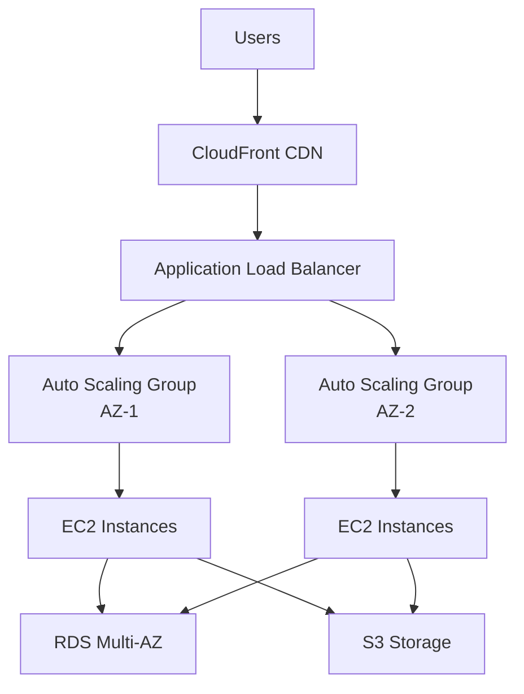

# Design Document: Analyze Mode

**Version:** 1.0  
**Status:** Ready for Implementation  
**Last Updated:** 2024-01-XX  
**Depends on:** 01-core-platform-architecture.md, 02-authentication-user-management.md

## Overview

Analyze Mode provides project-level analysis with multiple architecture options. Users input requirements, and the system generates 3 architecture options (Good/Better/Best) with trade-offs, risks, diagrams, and cost estimates.

## Requirements

### Functional Requirements

1. **Requirement Processing**
   - Accept natural language requirements
   - Extract key constraints (region, budget, performance, etc.)
   - Normalize to structured spec

2. **Architecture Generation**
   - Generate 3 options (Good/Better/Best)
   - Each option includes:
     - Architecture description
     - Trade-offs
     - Risks and assumptions
     - Cost estimate (ROM)
     - Architecture diagram

3. **Validation**
   - Validate regional service availability
   - Check resource schemas
   - Verify constraints are feasible

### Non-Functional Requirements

1. **Performance**: <8s (p95) with streaming
2. **Accuracy**: Validated against AWS documentation
3. **Visualization**: Clear architecture diagrams

## Architecture

### MCP Servers Used

1. **AWS Knowledge MCP Server** (HTTP)
   - Tools: `search_documentation`, `read_documentation`, `recommend`
   - Purpose: AWS best practices, patterns

2. **AWS Diagram MCP Server** (stdio)
   - Tools: `generate_architecture_diagram`
   - Purpose: Visual architecture diagrams

### Agent Configuration

```python
ANALYZE_SYSTEM_PROMPT = """You are an AWS solutions architect analyzing requirements and creating architecture options.

Your role:
1. Analyze requirements and extract key constraints
2. Generate 3 architecture options: Good (cost-effective), Better (balanced), Best (performance-optimized)
3. For each option, provide:
   - Architecture description
   - Trade-offs (cost, complexity, performance, scalability)
   - Risks and assumptions
   - Cost estimate (ROM)
   - AWS service recommendations

Available tools:
- awsdocs_*: AWS documentation search and recommendations
- diagram_*: Generate architecture diagrams (Mermaid format)

Guidelines:
- Base recommendations on AWS Well-Architected Framework
- Always cite AWS documentation
- Provide realistic cost estimates
- Consider operational complexity
"""
```

## Data Flow

```
User Requirements Input
    ↓
Frontend (React)
    ↓
POST /api/analyze/run
    ↓
Backend (Lambda)
    ↓
Strands Agent (with Knowledge + Diagram MCPs)
    ↓
1. Agent calls: awsdocs_search_documentation (AWS patterns)
    ↓
2. Agent calls: awsdocs_read_documentation (best practices)
    ↓
3. Agent normalizes requirements → structured spec
    ↓
4. Agent generates 3 options with trade-offs
    ↓
5. Agent calls: diagram_generate_architecture_diagram (for each option)
    ↓
6. Agent calculates cost estimates
    ↓
Stream results via WebSocket
    ↓
Frontend displays options with diagrams
```

## API Specification

### POST /api/analyze/run

**Request:**
```json
{
  "requirements": "Need a multi-AZ web app with auto-scaling, database, and CDN",
  "constraints": {
    "region": "us-east-1",
    "budget": "moderate",
    "availability": "99.9%",
    "security": "high"
  },
  "session_id": "uuid"
}
```

**Response (Streaming):**
```json
{
  "type": "analyzing",
  "message": "Analyzing requirements and searching AWS best practices..."
}

{
  "type": "validating",
  "message": "Validating service availability in us-east-1..."
}

{
  "type": "generating",
  "message": "Generating architecture options..."
}

{
  "type": "complete",
  "spec": {
    "normalized_requirements": {
      "compute": "web_application",
      "scaling": "auto_scaling",
      "database": "relational",
      "availability": "multi_az",
      "cdn": true
    }
  },
  "options": [
    {
      "id": "good",
      "name": "Good - Cost-Effective",
      "description": "EC2 Auto Scaling Groups with RDS Multi-AZ and CloudFront",
      "architecture": {
        "services": ["EC2", "Auto Scaling", "RDS", "CloudFront", "Application Load Balancer"],
        "pattern": "Three-tier web application"
      },
      "tradeoffs": {
        "cost": "Low ($500-800/month estimated)",
        "complexity": "Medium",
        "performance": "Good",
        "scalability": "Up to 10k concurrent users"
      },
      "risks": [
        "Manual scaling configuration required",
        "Limited global distribution"
      ],
      "assumptions": [
        "Moderate traffic (< 1M requests/day)",
        "Standard database load"
      ],
      "cost_estimate": {
        "monthly": 650,
        "breakdown": {
          "compute": 300,
          "database": 200,
          "storage": 50,
          "cdn": 100
        }
      },
      "diagram": {
        "format": "mermaid",
        "code": "graph TB\n    Users --> CF[CloudFront]\n    CF --> ALB[Application Load Balancer]..."
      }
    },
    {
      "id": "better",
      "name": "Better - Balanced",
      "description": "ECS Fargate with Aurora Serverless and CloudFront",
      // ... similar structure
    },
    {
      "id": "best",
      "name": "Best - Performance Optimized",
      "description": "EKS with Aurora Global Database and CloudFront + Route 53",
      // ... similar structure
    }
  ],
  "citations": [
    {
      "url": "https://docs.aws.amazon.com/wellarchitected/...",
      "title": "AWS Well-Architected Framework"
    }
  ]
}
```

## Frontend Components

### Analyze Interface

```typescript
// frontend/components/analyze/AnalyzeInterface.tsx
export const AnalyzeInterface: React.FC = () => {
  const [requirements, setRequirements] = useState('');
  const [constraints, setConstraints] = useState({
    region: 'us-east-1',
    budget: 'moderate',
    availability: '99.9%'
  });
  const [results, setResults] = useState<AnalysisResult | null>(null);
  const [isAnalyzing, setIsAnalyzing] = useState(false);

  const handleAnalyze = async () => {
    setIsAnalyzing(true);
    
    const response = await fetch('/api/analyze/run', {
      method: 'POST',
      headers: {
        'Content-Type': 'application/json',
        'Authorization': `Bearer ${getToken()}`
      },
      body: JSON.stringify({
        requirements,
        constraints,
        session_id: getSessionId()
      })
    });

    // Handle streaming response
    const reader = response.body?.getReader();
    const decoder = new TextDecoder();

    while (true) {
      const { done, value } = await reader!.read();
      if (done) break;

      const chunk = decoder.decode(value);
      const lines = chunk.split('\n').filter(l => l.trim());

      for (const line of lines) {
        if (line.startsWith('data: ')) {
          const data = JSON.parse(line.slice(6));
          
          if (data.type === 'complete') {
            setResults(data);
            setIsAnalyzing(false);
          }
          // Handle other streaming updates
        }
      }
    }
  };

  return (
    <div className="space-y-6">
      {/* Requirements Input */}
      <RequirementsInput
        value={requirements}
        onChange={setRequirements}
        placeholder="Describe your infrastructure requirements..."
      />

      {/* Constraints */}
      <ConstraintsSelector constraints={constraints} onChange={setConstraints} />

      {/* Analyze Button */}
      <button
        onClick={handleAnalyze}
        disabled={!requirements.trim() || isAnalyzing}
        className="px-6 py-3 bg-blue-600 text-white rounded-lg disabled:opacity-50"
      >
        {isAnalyzing ? 'Analyzing...' : 'Analyze Requirements'}
      </button>

      {/* Results */}
      {results && (
        <AnalysisResults options={results.options} citations={results.citations} />
      )}
    </div>
  );
};
```

### Analysis Results Display

```typescript
// frontend/components/analyze/AnalysisResults.tsx
export const AnalysisResults: React.FC<{ options: ArchitectureOption[], citations: Citation[] }> = ({
  options,
  citations
}) => {
  const [selectedOption, setSelectedOption] = useState('good');

  return (
    <div className="space-y-6">
      {/* Option Selector */}
      <div className="flex gap-4 border-b">
        {options.map(option => (
          <button
            key={option.id}
            onClick={() => setSelectedOption(option.id)}
            className={`
              px-6 py-3 font-semibold border-b-2 transition
              ${selectedOption === option.id
                ? 'border-blue-600 text-blue-600'
                : 'border-transparent text-gray-600 hover:text-gray-900'
              }
            `}
          >
            {option.name}
          </button>
        ))}
      </div>

      {/* Selected Option Details */}
      {options.find(o => o.id === selectedOption) && (
        <OptionDetails option={options.find(o => o.id === selectedOption)!} />
      )}

      {/* Citations */}
      <CitationsList citations={citations} />
    </div>
  );
};

const OptionDetails: React.FC<{ option: ArchitectureOption }> = ({ option }) => {
  return (
    <div className="space-y-6">
      {/* Architecture Diagram */}
      <div className="border rounded-lg p-4 bg-gray-50">
        <h3 className="font-semibold mb-4">Architecture Diagram</h3>
        <DiagramRenderer format={option.diagram.format} code={option.diagram.code} />
      </div>

      {/* Description */}
      <div>
        <h3 className="font-semibold mb-2">Architecture Overview</h3>
        <p className="text-gray-700">{option.description}</p>
      </div>

      {/* Trade-offs Table */}
      <TradeoffsTable tradeoffs={option.tradeoffs} />

      {/* Cost Estimate */}
      <CostEstimate estimate={option.cost_estimate} />

      {/* Risks & Assumptions */}
      <div className="grid grid-cols-2 gap-4">
        <RisksList risks={option.risks} />
        <AssumptionsList assumptions={option.assumptions} />
      </div>

      {/* Actions */}
      <div className="flex gap-4">
        <button
          onClick={() => navigateToImplement(option)}
          className="px-6 py-3 bg-blue-600 text-white rounded-lg"
        >
          Generate Implementation
        </button>
        <button className="px-6 py-3 border rounded-lg">
          Save for Later
        </button>
      </div>
    </div>
  );
};
```

## Backend Implementation

### Analyze Route Handler

```python
# backend/routes/analyze.py
@router.post("/run")
async def analyze_requirements(
    request: AnalyzeRequest,
    user: dict = Depends(get_current_user)
):
    """Analyze requirements and generate architecture options"""
    
    # Create agent with Knowledge + Diagram MCPs
    agent = await create_analyze_agent(user["org_id"])
    
    # Analyze and generate options
    prompt = f"""Analyze these requirements and create 3 architecture options:

Requirements: {request.requirements}
Constraints: {json.dumps(request.constraints)}

Steps:
1. Search AWS documentation for relevant patterns
2. Validate service availability in {request.constraints.get('region', 'us-east-1')}
3. Generate 3 options: Good (cost-effective), Better (balanced), Best (performance)
4. For each option:
   - Describe architecture
   - List trade-offs (cost, complexity, performance, scalability)
   - Identify risks and assumptions
   - Estimate costs (ROM)
   - Generate architecture diagram (Mermaid format)

Return JSON format with options array.
"""
    
    response = await agent.invoke(prompt)
    
    # Parse structured response
    options = parse_options(response)
    
    return {
        "success": True,
        "spec": extract_normalized_spec(response),
        "options": options,
        "citations": extract_citations(response)
    }

async def create_analyze_agent(org_id: str) -> Agent:
    """Create agent with Knowledge + Diagram MCP servers"""
    
    # AWS Knowledge MCP (HTTP)
    aws_knowledge = MCPClient(
        lambda: http_client("https://knowledge-mcp.global.api.aws"),
        tool_filters={"prefix": "awsdocs"},
        prefix="awsdocs"
    )
    
    # Diagram MCP (stdio)
    diagram_mcp = MCPClient(
        lambda: stdio_client(StdioServerParameters(
            command="uv",
            args=["tool", "run", "--from", "awslabs.aws-diagram-mcp-server@latest", "awslabs.aws-diagram-mcp-server.exe"]
        )),
        tool_filters={"prefix": "diagram"},
        prefix="diagram"
    )
    
    with aws_knowledge, diagram_mcp:
        tools = []
        tools.extend(aws_knowledge.list_tools_sync())
        tools.extend(diagram_mcp.list_tools_sync())
        
        agent = Agent(
            tools=tools,
            system_prompt=ANALYZE_SYSTEM_PROMPT
        )
        
        return agent
```

## Diagram Generation

### Mermaid Diagram Format

The diagram MCP server should generate Mermaid diagrams like:



### Diagram Rendering Frontend

```typescript
// frontend/components/analyze/DiagramRenderer.tsx
import { Mermaid } from '@mermaid-js/react-mermaid';

export const DiagramRenderer: React.FC<{ format: string, code: string }> = ({ format, code }) => {
  if (format === 'mermaid') {
    return (
      <div className="bg-white p-4 rounded border">
        <Mermaid chart={code} />
      </div>
    );
  }
  
  // Handle other formats (SVG, PNG, etc.)
  return <div>Unsupported format: {format}</div>;
};
```

## Cost Estimation

```python
# backend/services/cost_estimator.py

COST_ESTIMATES = {
    "ec2": {
        "t3.medium": 0.0416,  # per hour
        "t3.large": 0.0832
    },
    "rds": {
        "db.t3.medium": 0.073,  # per hour
        "db.t3.large": 0.146
    },
    "cloudfront": {
        "data_transfer": 0.085  # per GB
    }
}

def estimate_cost(architecture: dict, region: str) -> dict:
    """Estimate monthly cost for architecture"""
    
    monthly_cost = 0
    breakdown = {}
    
    # Estimate compute costs
    if "ec2" in architecture.get("services", []):
        instance_count = architecture.get("instance_count", 2)
        instance_type = architecture.get("instance_type", "t3.medium")
        hourly_cost = COST_ESTIMATES["ec2"][instance_type]
        monthly_cost += hourly_cost * instance_count * 730  # hours per month
        breakdown["compute"] = monthly_cost
    
    # Estimate database costs
    if "rds" in architecture.get("services", []):
        # Similar calculation
        pass
    
    # Add other services
    
    return {
        "monthly": round(monthly_cost, 2),
        "breakdown": breakdown,
        "note": "ROM estimate, actual costs may vary"
    }
```

## Validation

### Regional Availability Check

```python
# Note: Use AWS Knowledge MCP or Regional Availability MCP
async def validate_regional_availability(services: List[str], region: str) -> dict:
    """Validate services are available in region"""
    
    # This would use AWS Regional Availability MCP if available
    # For now, use hardcoded knowledge or AWS docs
    
    unavailable = []
    for service in services:
        # Check if service is available in region
        if not is_service_available(service, region):
            unavailable.append(service)
    
    return {
        "available": len(unavailable) == 0,
        "unavailable_services": unavailable,
        "region": region
    }
```

## Quota Management

```python
ANALYZE_QUOTAS = {
    "free": {"analyses_per_month": 5},
    "pro": {"analyses_per_month": 20},
    "enterprise": {"analyses_per_month": -1}
}

@router.post("/run")
async def analyze_requirements(...):
    """Check quota before analyzing"""
    
    org = db.organizations.get(user["org_id"])
    quota = ANALYZE_QUOTAS[org.subscription_tier]["analyses_per_month"]
    
    if quota > 0:
        usage = db.usage_metrics.get_analyze_usage_this_month(user["org_id"])
        if usage >= quota:
            raise HTTPException(429, "Monthly quota exceeded")
    
    # Process analysis
    # ...
```

## Testing Requirements

### Unit Tests
- Requirement normalization
- Option generation logic
- Cost estimation calculations
- Diagram format validation

### Integration Tests
- Complete analyze flow
- MCP server integration
- Diagram generation
- Cost calculation

### Performance Tests
- Response time <8s (p95)
- Concurrent analysis handling
- Streaming performance

## Implementation Checklist

- [ ] Set up AWS Knowledge + Diagram MCP clients
- [ ] Implement requirement processing
- [ ] Build option generation logic
- [ ] Add diagram generation
- [ ] Implement cost estimation
- [ ] Add regional validation
- [ ] Build frontend components
- [ ] Add diagram rendering (Mermaid)
- [ ] Implement streaming responses
- [ ] Add quota checking
- [ ] Write comprehensive tests

## Metrics to Track

- Analysis count per organization
- Average response time
- Option selection distribution (Good/Better/Best)
- Cost estimation accuracy
- Diagram generation success rate
- Most analyzed patterns

---

**Next Steps**: Proceed to Implement Mode design doc.

